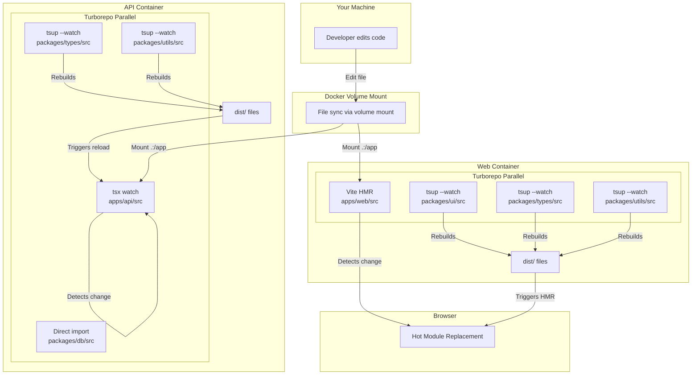
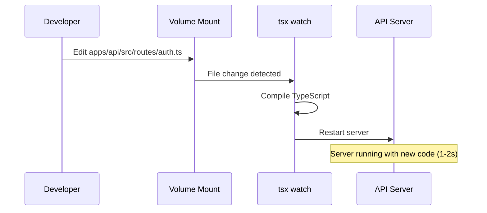
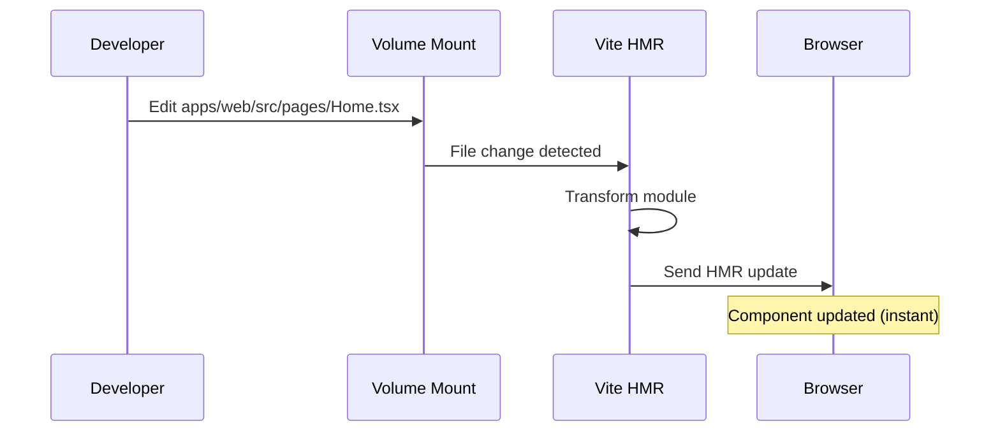
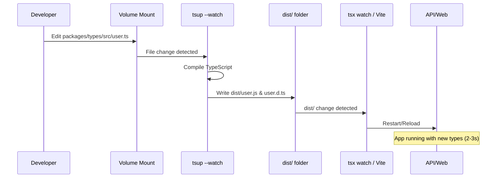
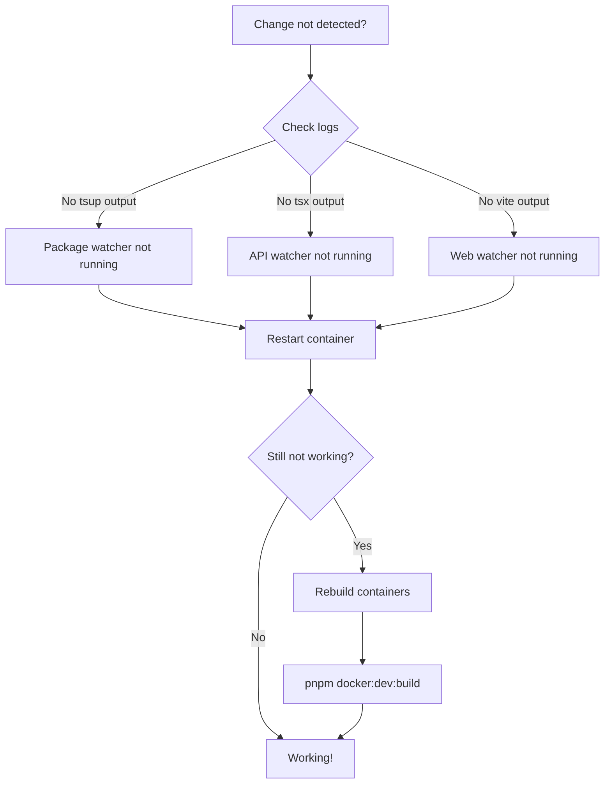

# Docker Hot Reload Flow Diagram

## Complete System Architecture



## Change Detection Flow

### Scenario 1: Edit API Source File



### Scenario 2: Edit Web Source File



### Scenario 3: Edit Package Source File



## Parallel Execution

### API Container Process Tree

```text
sh -c "..."
└── turbo run dev --parallel
    ├── pnpm --filter @myorg/api dev
    │   └── tsx watch src/index.ts
    │       └── Node.js API Server (port 3001)
    ├── pnpm --filter @myorg/types dev
    │   └── tsup --watch
    │       └── Watching packages/types/src/**
    ├── pnpm --filter @myorg/utils dev
    │   └── tsup --watch
    │       └── Watching packages/utils/src/**
    └── pnpm --filter @myorg/db dev
        └── (no build needed, direct import)
```

### Web Container Process Tree

```text
sh -c "..."
└── turbo run dev --parallel
    ├── pnpm --filter @myorg/web dev
    │   └── vite
    │       └── Vite Dev Server (port 5173)
    ├── pnpm --filter @myorg/ui dev
    │   └── tsup --watch
    │       └── Watching packages/ui/src/**
    ├── pnpm --filter @myorg/types dev
    │   └── tsup --watch
    │       └── Watching packages/types/src/**
    └── pnpm --filter @myorg/utils dev
        └── tsup --watch
            └── Watching packages/utils/src/**
```

## File Watching Strategy

### Volume Mount Configuration

```yaml
volumes:
  - .:/app # Mount entire project
  - /app/node_modules # Preserve container's node_modules
  - /app/packages/db/node_modules # Preserve package node_modules
  - /app/packages/types/node_modules
  - /app/packages/utils/node_modules
  - /app/apps/api/node_modules
```

**Why anonymous volumes?**

- Container's `node_modules` are optimized for Linux
- Host's `node_modules` might be for different OS (Windows/Mac)
- Anonymous volumes prevent host from overwriting container's modules

### Vite Polling Configuration

```typescript
// apps/web/vite.config.ts
server: {
  host: true,              // Listen on 0.0.0.0 (accessible from host)
  watch: {
    usePolling: true,      // Use polling instead of native file watching
    interval: 1000,        // Check every 1 second
  }
}
```

**Why polling?**

- Native file watching (inotify) doesn't work reliably with Docker volumes
- Polling checks for changes at regular intervals
- Trade-off: More CPU usage, but reliable change detection

## Performance Characteristics

### Change Detection Latency

| Component  | Detection Method  | Latency |
| ---------- | ----------------- | ------- |
| tsx watch  | Native (chokidar) | ~100ms  |
| Vite HMR   | Polling (1000ms)  | ~1s     |
| tsup watch | Native (chokidar) | ~100ms  |

### Rebuild Times

| Package      | Size   | Rebuild Time |
| ------------ | ------ | ------------ |
| @myorg/types | Small  | ~500ms       |
| @myorg/utils | Small  | ~500ms       |
| @myorg/ui    | Medium | ~1s          |

### Total Feedback Loop

| Change Type    | Detection | Build | Reload | Total |
| -------------- | --------- | ----- | ------ | ----- |
| API source     | 100ms     | 0ms   | 1s     | ~1-2s |
| Web source     | 1s        | 0ms   | 100ms  | ~1s   |
| Package source | 100ms     | 500ms | 1s     | ~2-3s |

## Optimization Tips

### Reduce Polling Interval (Less CPU)

```typescript
// apps/web/vite.config.ts
watch: {
  usePolling: true,
  interval: 2000,  // Check every 2 seconds instead of 1
}
```

### Exclude Directories from Watching

```typescript
// apps/web/vite.config.ts
watch: {
  ignored: ['**/node_modules/**', '**/dist/**', '**/.git/**', '**/uploads/**'];
}
```

### Use Docker Desktop with WSL2 (Windows)

- Native Linux file system performance
- Better volume mount performance
- Faster file watching

### Use Docker Desktop (Mac)

- VirtioFS for better volume performance
- Enable "Use the new Virtualization framework"
- Enable "VirtioFS accelerated directory sharing"

## Troubleshooting Flow



## Summary

The hot reload system uses a three-tier approach:

1. **Volume Mounts**: Sync files from host to container
2. **File Watchers**: Detect changes (tsx, vite, tsup)
3. **Parallel Execution**: Run all watchers simultaneously via Turborepo

This provides a fast, reliable development experience without manual rebuilds.
